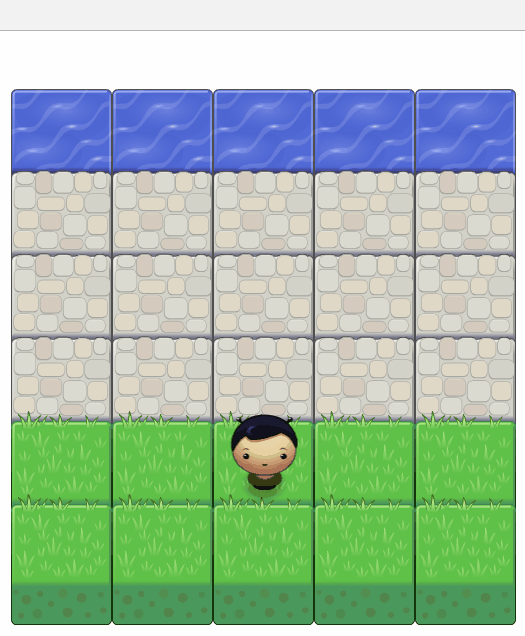

HTML5-Arcade-Game
===============================
## :video_game: How to Play 
 - load index.html in your favorite browser
 - make your player reach the water, without colliding into any one of the enemies(bugs)
 - The player can move left, right, up and down. 
 - The enemies move in varying speeds on the paved block portion of the scene. 
 - Once a the player collides with an enemy, the game is reset and the player moves back to the start square. 
 - Once the player reaches the water the game is won.

## Controls:
 - Left Arrow: move left
 - Right Arrow: move right
 - Down Arrow: move down
 - Up Arrow: move up

